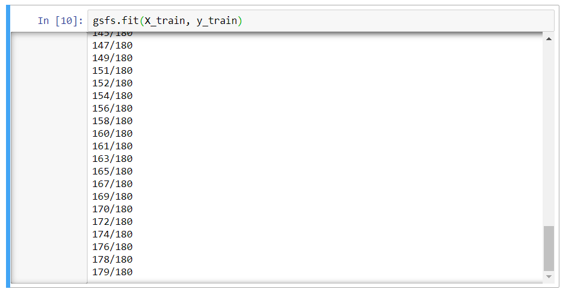
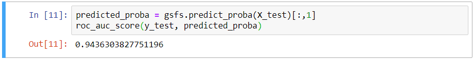
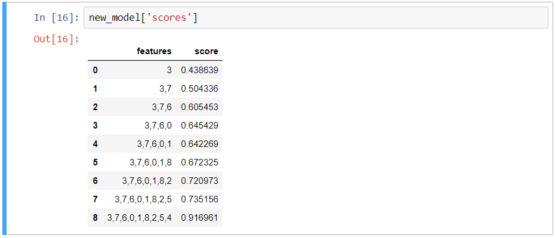
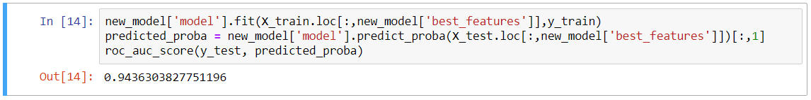

# Graph Search Feature Selection
This is a package for Feature Selection, that is an relaying on work from paper https://hal.inria.fr/inria-00484049/document. 
This version is using graph to represent the structure during search and concepts like RAVE, UCB1 and Monte-Carlo Tree Search
(instead of tree graph is searched).

## Instalation
Download package from github and unpack
Install using pip by runing:

```
pip install .
```

## Manual

First, import needed packages:

```
from gsfs.feature_selection.GSFS import *
from sklearn.svm import SVC
from sklearn.model_selection import train_test_split
from sklearn.metrics import roc_auc_score
```

Then load data (in this example dataset is fetched from openml.org, but pandas.read_csv can be used as well):

```
import openml

task = openml.tasks.get_task(49)
df,out = task.get_X_and_y()
df = pd.DataFrame(df)
df.columns = list(map(str,list(df.columns)))
out = pd.Series(out)
```

Package requires the dataset to be pandas.DataFrame and output variable to be pandas.Series. Then GSFS object can be initialized:

```
model = SVC(probability=True, gamma ='scale', random_state=123)
gsfs = GSFS(
        model=model, 
        calculations_budget=len(df.columns)*20,
        multiarm_strategy='continuous')
```

First line creates a SVM model that will be used during Feature Selection. Constructor of GSFS takes 3 parameters in this instance:

* model - model used for Feature Selection
* calculations_budget - number of iterations
* multiarm_strategy - type of strategy to use during search

If the dataset has some not numerical columns, then it needs to be one-hot encoded:
```
df = gsfs.one_hot_encode(df)
```

After that the dataset can be split into train and test subsets and object can be fitted:

```
X_train, X_test, y_train, y_test = train_test_split(
        df, 
        out, 
        test_size=0.25,
        random_state = 123)
gsfs.fit(X_train, y_train)
```

The results of the fitting are shown during the running of the algorithm:


After the fitting is done, the predictions can be made:

```
predicted_proba = gsfs.predict_proba(X_test)[:,1]
print(roc_auc_score(y_test, predicted_proba))
```



These predictions are made on input model (in this instance SVM) trained on best subset of variables found during graph search.
To get best model based on greedy approach (in i-th each iteration model is trained on top 1 features ordered by feature importance), the method can be used:

```
new_model = gsfs.get_best_model(X_train, y_train)
```

After that, scores for all models from greedy approach can be inspected:
```
new_model['scores']
```



And best model can be fitted and used:

```
new_model['model'].fit(X_train.loc[:,new_model['best_features']],y_train)
predicted_proba = new_model['model'].predict_proba(X_test.loc[:,new_model['best_features']])[:,1]
roc_auc_score(y_test, predicted_proba)
```



## Manual
To see all available methods and parameters, please run help on either whole module or selected method:

```
help(GSFS)
help(GSFS.fit)
```
